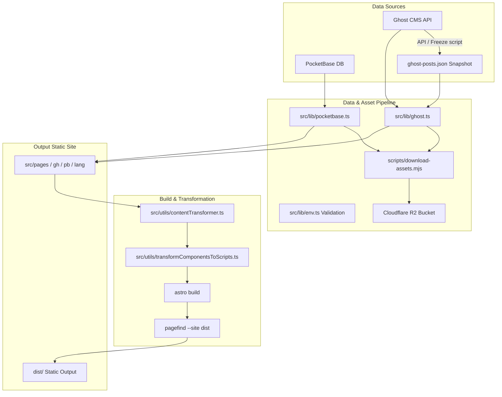

# Architecture Documentation: `tj-static`

This document provides a comprehensive structural and technical overview of `tj-static`, a static site generator built with Astro for educational ESL materials, blog posts, and interactive worksheets.

---

## 1. Core Technology Stack

- **Framework**: [Astro 7](https://astro.build/) (Static Site Generation / SSG mode)
- **Styling**: [Tailwind CSS v4](https://tailwindcss.com/) via `@tailwindcss/vite`
- **Search Engine**: [Pagefind](https://pagefind.app/) static search index generated post-build (`pagefind --site dist`)
- **Data & CMS Layer**:
  - **Ghost CMS**: Headless CMS via `@tryghost/content-api` with fallback offline snapshot (`src/data/ghost-posts.json`).
  - **PocketBase**: Self-hosted backend accessed via `pocketbase` SDK and TypeScript schemas (`pocketbase-types.ts`).
- **Media & Asset Storage**: Local static assets served from `public/` or external Cloudflare R2 bucket storage via AWS S3 SDK (`@aws-sdk/client-s3`).
- **Interactive UI Engine**: Custom web components (`tj-components`, e.g., `<tj-quiz-element>`, `<tj-chapter-book>`) transformed at build time.

---

## 2. System Architecture & Data Flow



---

## 3. Key Components & Subsystems

### 3.1 Data Layer & CMS Integrations
- **Ghost CMS (`src/lib/ghost.ts` & `src/lib/ghost-utils.ts`)**:
  - Fetches posts, pages, and tags from Ghost Content API.
  - Includes offline snapshot fallback (`scripts/freeze-ghost.mjs` outputs `src/data/ghost-posts.json`) if API credentials are not supplied during local builds.
- **PocketBase (`src/lib/pocketbase.ts` & `src/lib/pb-worksheet-mapper.ts`)**:
  - Interacts with PocketBase collections (`worksheets`, `topics`, `levels`, `tags`).
  - Uses typed interface mapping generated in `pocketbase-types.ts`.
- **Environment Management (`src/lib/env.ts`)**:
  - Centralizes configuration for build and runtime environments (`GHOST_API_URL`, `GHOST_CONTENT_API_KEY`, `PUBLIC_POCKETBASE_URL`, `PUBLIC_SUBMISSION_URL`).
  - `.env` files are used strictly for **local development**. Production build variables and secrets must be configured directly in **Cloudflare Pages** settings (`Settings -> Environment Variables / Secrets`).
  - `PUBLIC_SUBMISSION_URL` intentionally defaults to an empty string (`''`) to prevent security/privacy leaks when repository forks or clones are built without explicitly configured credentials.

### 3.2 Asset Resolution & Cloud Storage Pipeline

#### Media Serving Architecture & Zero-Droplet Rule
To protect the DigitalOcean Droplet (`pb.teacherjake.com`) from media bandwidth and load, **NO public media assets (images, audio MP3s, PDF attachments) are served directly from `pb.teacherjake.com` in production**. `pb.teacherjake.com` functions strictly as a build-time API database.

1. **Images (`.jpg`, `.png`, `.webp`, `.avif`, `.svg`)**:
   - Downloaded from Cloudflare R2 to `src/assets/pocketbase-assets/` (or `ghost-assets/`) by `scripts/download-assets.mjs` during static build.
   - Astro processes, compresses, and bundles them into static output (`dist/_astro/`), served directly from **Cloudflare Pages** edge CDN.
   - **Fallback Rule**: If an image is not bundled locally, all fallback URLs resolve directly to Cloudflare R2 (`https://files.teacherjake.com/{collectionId}/{recordId}/{filename}`).

2. **Audio Clips (`.mp3`) & Attachments (`.pdf`)**:
   - Stored directly in Cloudflare R2 object storage (`files` bucket).
   - Resolved via `resolveLocalizedAsset()` in `src/utils/assetResolver.ts` to `https://files.teacherjake.com/{collectionId}/{recordId}/{filename}`.
   - Served directly from Cloudflare R2 edge network.

#### Build-Time Asset Sync (`scripts/download-assets.mjs`)
- Executed automatically before `astro build`.
- Concurrently syncs PocketBase worksheet records (`CONCURRENCY_LIMIT = 15`) and downloads image files from R2 into `src/assets/`.
- Maintains an in-memory R2 cache and local `.404` markers to skip duplicate or missing file requests, reducing sync time to ~8s.

### 3.3 Content Transformation & Web Component Integration
Custom web components (from `tj-components`) provide rich interactive features in lessons and posts.

- **Transformer Pipeline (`src/utils/contentTransformer.ts`)**:
  - Replaces raw HTML embeds, standardizes YouTube embeds (`transformYouTubeEmbeds.ts`), and parses custom components.
- **Script Injection & `submission-url` Transformation (`src/utils/transformComponentsToScripts.ts`)**:
  - Converts component configurations into property-injected JS scripts (`element.config = data`), avoiding DOM attribute bloat and quote escaping issues (see `component-data-instructions.md`).
  - Automatically injects or replaces `submission-url="..."` on all custom web component tags (`<tj-*>`), provided `PUBLIC_SUBMISSION_URL` is set in the environment.
- **Markdown-like Parsing (`tj-quiz-element`)**:
  - Custom parser splits `---` section dividers for cloze tests, vocabulary matching, reading passages, and audio blocks.


---

## 4. Routing Structure (`src/pages/`)

| Route Pattern | File / Handler | Purpose |
| :--- | :--- | :--- |
| `/` | `src/pages/index.astro` | Main landing page highlighting featured worksheets & posts |
| `/[lang]/...` | `src/pages/[lang]/[...page].astro` | Multi-language post/worksheet paginated listing |
| `/[lang]/level/[level]/...` | `src/pages/[lang]/level/[level]/[...page].astro` | Difficulty level filtered content |
| `/[lang]/tag/[tag]/...` | `src/pages/[lang]/tag/[tag]/[...page].astro` | Tag filtered content |
| `/gh/[slug]` | `src/pages/gh/[slug].astro` | Ghost post detail view |
| `/pb/[id]` | `src/pages/pb/[id].astro` | PocketBase worksheet detail view |
| `/contact`, `/privacy`, `/ai-disclaimer` | Static `.astro` files | Information & legal pages |

---

## 5. Directory Tree Overview

```text
tj-static/
├── .agents/                    # Agent rules, skills, and configuration
├── public/                     # Static public assets (favicons, fonts, images)
├── scripts/                    # Pre-build data & asset downloading / R2 upload scripts
├── src/
│   ├── assets/                 # Local image & icon assets
│   ├── components/             # Reusable Astro UI components (Navigation, Search, Card, etc.)
│   ├── data/                   # Fallback static datasets (ghost-posts.json)
│   ├── layouts/                # Base HTML shell and listing page layouts
│   ├── lib/                    # SDK clients & data mappers (Ghost, PocketBase, Env)
│   ├── pages/                  # File-based routing (Index, Localized listings, Ghost, PocketBase)
│   ├── styles/                 # Global styles & Tailwind configuration
│   └── utils/                  # Content transformers, slugifiers, and asset resolvers
├── component-data-instructions.md # Usage specification for custom web components
├── pocketbase-types.ts         # TypeScript schema definitions for PocketBase collections
├── astro.config.mjs            # Astro configuration with Tailwind & Sitemap integrations
└── package.json                # Project dependencies & build scripts
```

---

## 6. Build & Deployment Lifecycle

1. **Pre-build Asset Fetching**:
   ```bash
   node ./scripts/download-assets.mjs
   ```
2. **Astro Static Site Generation**:
   ```bash
   astro build
   ```
3. **Static Search Indexing**:
   ```bash
   pagefind --site dist
   ```

Output is emitted to the `dist/` folder, ready for static hosting deployment (Cloudflare Pages, Vercel, Netlify, or Nginx).
